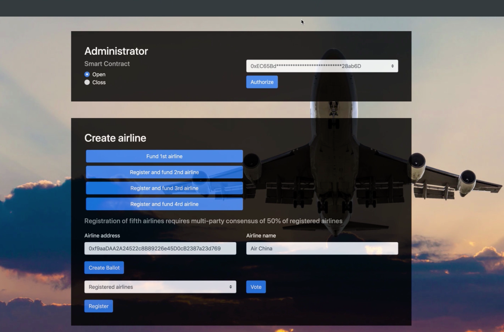
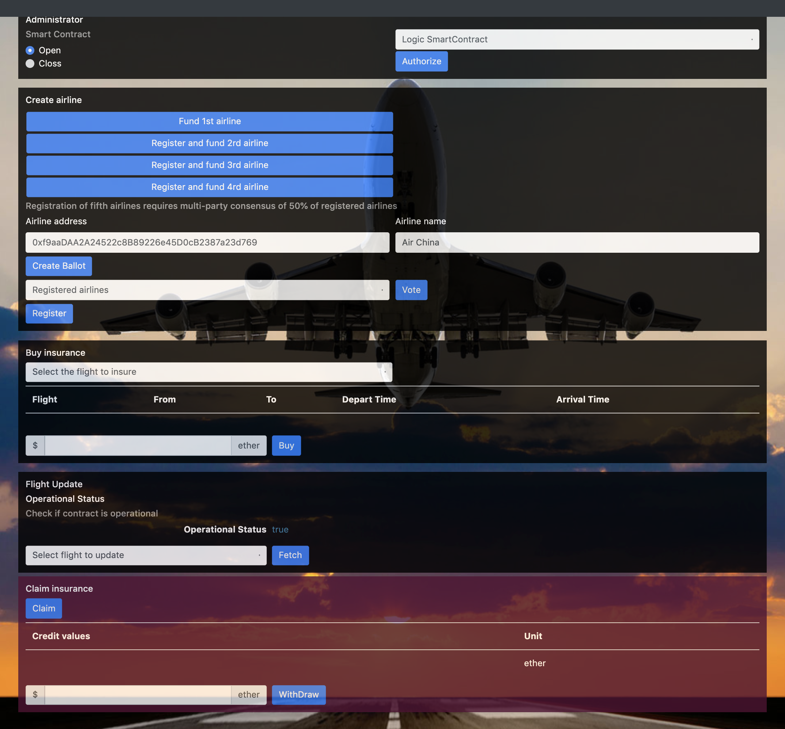
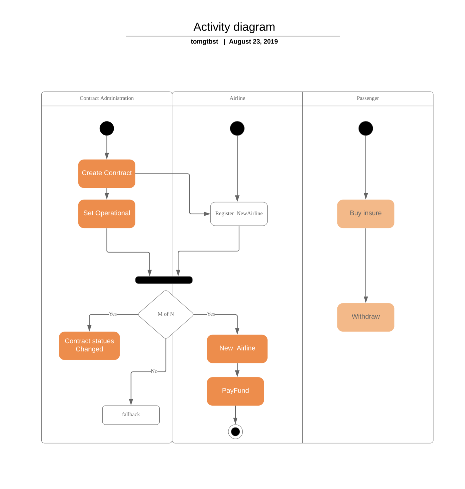
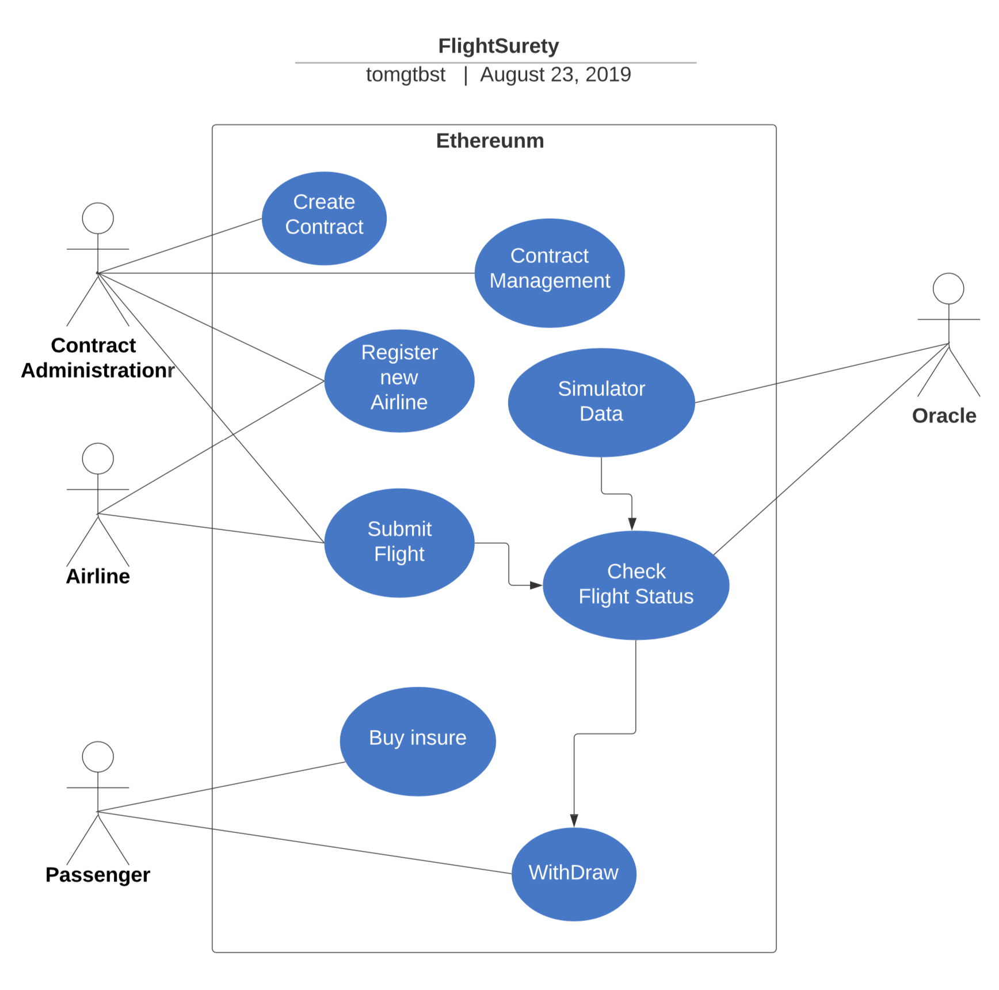
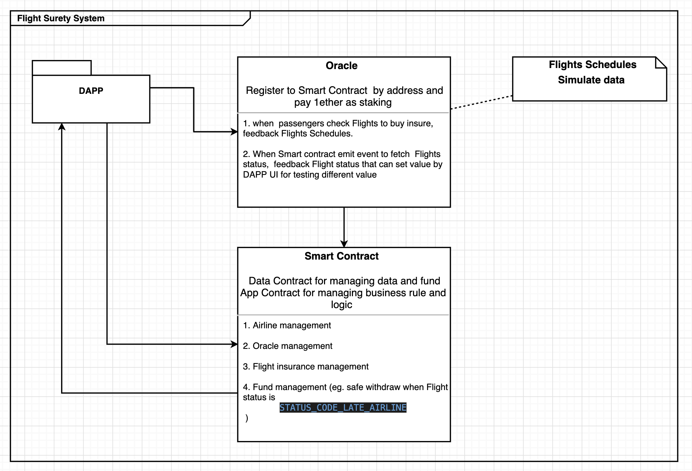

# FlightSurety

FlightSurety is a sample application project for Udacity's Blockchain course.


* [Project introduction](https://mp.weixin.qq.com/s?__biz=MzIxNzU3MjA0OA==&mid=2247483673&idx=1&sn=0f97a255bd16a39e69f6e9cb8115a453&chksm=97f6f6a6a0817fb0f50a9d846560834b9bd4ad0494c698a841743d07ac1dd738e13be52a75e7&token=312677330&lang=zh_CN#rd)

## Install

This repository contains Smart Contract code in Solidity (using Truffle), tests (also using Truffle), dApp scaffolding (using HTML, CSS and JS) and server app scaffolding.

To install, download or clone the repo, then:

```
$npm install
```

```
$truffle compile
```

## Develop Client

To compile project:

```
$truffle compile --all
```

To run truffle tests:

```
$truffle test
```

To use the dapp:

```
$truffle migrate --reset
```

```
$npm run dapp
```

To view dapp:

`http://localhost:8000`

## Develop Server
```
npm run server
```

## Deploy

To build dapp for prod:
`npm run dapp:prod`

Deploy the contents of the ./dapp folder
### Homepage



### Activity Diagram



### Basic Use Case



### System



## Versioning

We use [SemVer](http://semver.org/) for versioning. For the versions available, see the [tags on this repository](https://github.com/your/project/tags).

## Built With

* [Ethereum](https://www.ethereum.org/) - Ethereum is a decentralized platform that runs smart contracts
* [IPFS](https://ipfs.io/) - IPFS is the Distributed Web | A peer-to-peer hypermedia protocol
to make the web faster, safer, and more open.
* [Truffle Framework](http://truffleframework.com/) - Truffle is the most popular development framework for Ethereum with a mission to make your life a whole lot easier.

## Authors

* **Tom gt** - *Fullstack egineer* - [github profile](https://github.com/tomgtbst)

## License

This project is licensed under the MIT License

## Resources

* [How does Ethereum work anyway?](https://medium.com/@preethikasireddy/how-does-ethereum-work-anyway-22d1df506369)
* [BIP39 Mnemonic Generator](https://iancoleman.io/bip39/)
* [Truffle Framework](http://truffleframework.com/)
* [Ganache Local Blockchain](http://truffleframework.com/ganache/)
* [Remix Solidity IDE](https://remix.ethereum.org/)
* [Solidity Language Reference](http://solidity.readthedocs.io/en/v0.4.24/)
* [Ethereum Blockchain Explorer](https://etherscan.io/)
* [Web3Js Reference](https://github.com/ethereum/wiki/wiki/JavaScript-API)
